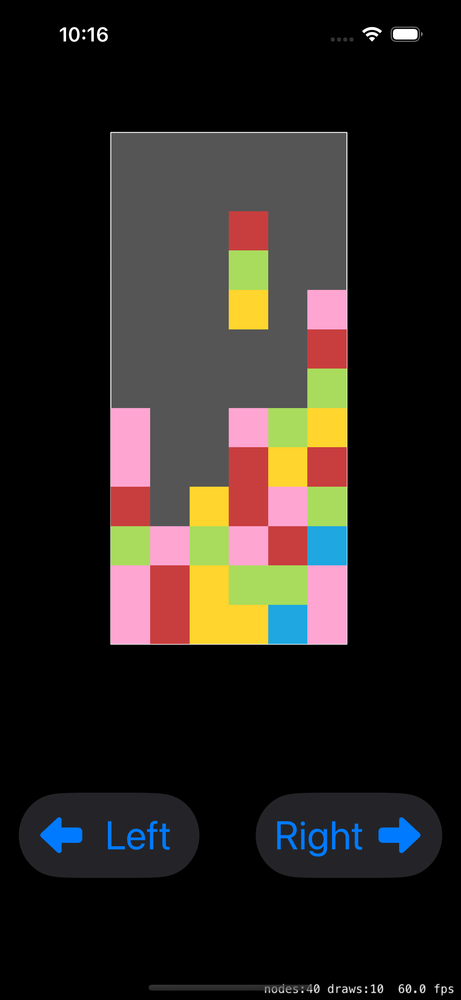

# Match3Puzzle Template

### Comming aoon.

### Description:

This project is a component of a Tetris-like game under development.

### Starting from the first content, here is an explanation of what each file represents:

#### Board.swift:

This file likely handles the game board, including the layout and mechanics of the blocks.
The file includes an enumeration for different gem types (colors), which might be used to represent Tetris pieces.

このファイルはおそらく、ブロックのレイアウトや仕組みを含むゲーム盤を扱います。
このファイルには、テトリスの駒を表すのに使われるであろう、さまざまな宝石の種類（色）の列挙が含まれています。

#### MatchPuzzle.swift:

This file contains the main entry point for the SwiftUI application, setting up the initial view and the application lifecycle.

このファイルは初期ビューとアプリケーションのライフサイクルを設定するSwiftUIアプリケーションのメインエントリーポイントを含みます。

#### ContentView.swift:

This file integrates SpriteKit with SwiftUI, setting up the main game scene and providing the user interface where the game will be displayed.

このファイルはSpriteKitとSwiftUIを統合し、メインのゲームシーンを設定し、ゲームが表示されるユーザーインターフェイスを提供します。

#### GameScene.swift:

This file is the core of the game logic, handling the game scene's behaviors, such as rendering, updating, and interacting with the pieces on the board.

このファイルはゲームロジックの中核で、ゲームシーンのレンダリング、更新、ボード上の駒とのインタラクションなどの動作を処理します。

#### Vector.swift:

This file defines a Vector structure, which is used for handling coordinates and vector mathematics, essential for controlling the movement and positioning of the game pieces.

このファイルはベクター構造体を定義し、ゲーム駒の移動と位置の制御に不可欠な座標とベクター数学の処理に使用されます。
